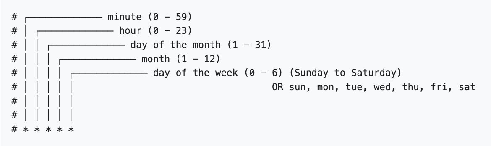

# Sleep all your Okteto namespaces on a schedule

> This is an experiment and Okteto does not officially support it. 

- Create an [Okteto Admin Token](https://www.okteto.com/docs/admin/dashboard/#admin-access-tokens)

- Export the token to a local variable:

```bash
export OKTETO_ADMIN_TOKEN=<<your-token>>
```

- Create a namespace, and, via the admin section, mark it as [Keep awake](https://www.okteto.com/docs/admin/dashboard/#namespaces)

- Export the namespace name to a local variable: 

```bash
export NAMESPACE=<<your-namespace>>
```

- Create a local variable to define the sleep cronjob schedule:
the following secrets on your Okteto instance.

```bash
export SLEEP_JOB_SCHEDULE="0 20 * * *"
```



For example, 0 0 13 * 5 states that the task must be started every Friday at midnight, as well as on the 13th of each month at midnight.

- Run `okteto deploy -n ${NAMESPACE} --var OKTETO_ADMIN_TOKEN=${OKTETO_ADMIN_TOKEN}` to build the image and create the cronjob.

